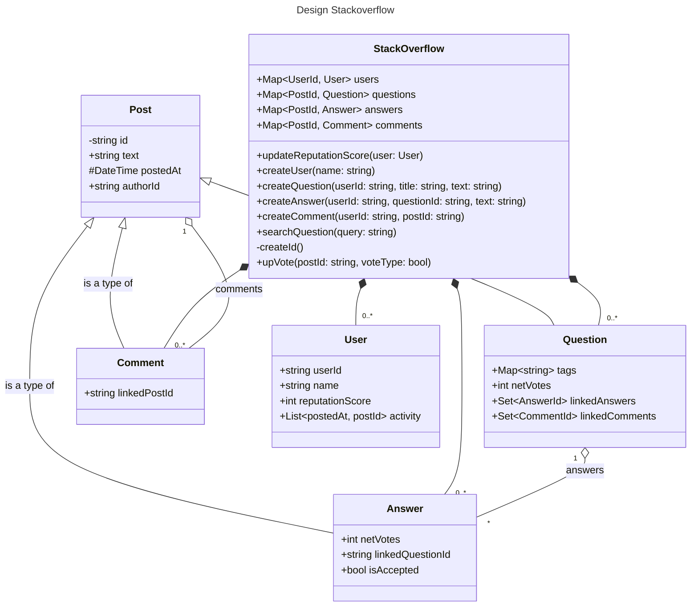

```mermaid
---
title: Design Stackoverflow
---
classDiagram
    %% note "From Duck till Zebra"
    %% note for Duck "can fly\ncan swim\ncan dive\ncan help in debugging"

    %% Inheritance relations
    Post <|-- Question: is a type of
    Post <|-- Answer: is a type of
    Post <|-- Comment: is a type of

    %% Composition relations
    StackOverflow *-- "0..*" User
    StackOverflow *-- "0..*" Question
    StackOverflow *-- "0..*" Answer
    StackOverflow *-- "0..*" Comment

    %% Association relations
    Question "1" o-- "*" Answer : answers
    Post "1" o-- "*" Comment : comments


    class StackOverflow{
        +Map~UserId, User~ users
        +Map~PostId, Question~ questions
        +Map~PostId, Answer~ answers
        +Map~PostId, Comment~ comments
        +updateReputationScore(user: User)
        +createUser(name: string)
        +createQuestion(userId: string, title: string, text: string)
        +createAnswer(userId: string, questionId: string, text: string)
        +createComment(userId: string, postId: string)
        +searchQuestion(query: string)
        -createId()
        +upVote(postId: string, voteType: bool)
    }
    class User{
        +string userId
        +string name
        +int reputationScore
        +List~postedAt, postId~ activity
    }
    class Post{
        -string id
        +string text
        #DateTime postedAt
        +string authorId
    }
    class Question{
        +Map~string~ tags
        +int netVotes
        +Set~AnswerId~ linkedAnswers
        +Set~CommentId~ linkedComments
    }
    class Answer{
        +int netVotes
        +string linkedQuestionId
        +bool isAccepted
    }
    class Comment{
        +string linkedPostId
    }
```